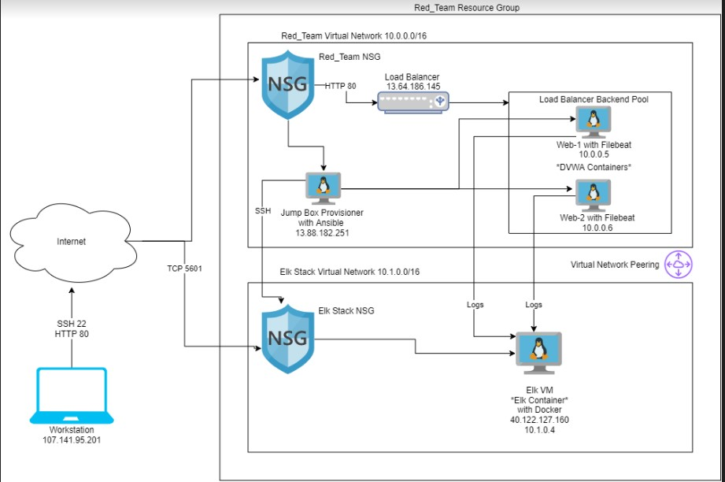

# ELK-Stack-Project-1
## Automated ELK Stack Deployment

The files in this repository were used to configure the network depicted below.

These files have been tested and used to generate a live ELK deployment on Azure. They can be used to either recreate the entire deployment pictured above. Alternatively, select portions of the playbook file may be used to install only certain pieces of it, such as Filebeat.

  - /etc/ansible/install-elk1.yml

This document contains the following details:
- Description of the Topology
- Access Policies
- ELK Configuration
  - Beats in Use
  - Machines Being Monitored
- How to Use the Ansible Build

### Description of the Topology

The main purpose of this network is to expose a load-balanced and monitored instance of DVWA, the D*mn Vulnerable Web Application.

Load balancing ensures that the application will be highly secure, in addition to restricting access to the network.
        What aspect of security do load balancers protect?
        Load balancers evenly distribute HTTP traffic to the server to protect against DDoS attacks.
        What is the advantage of a jump box?
        Jump boxes provide secure connection to the server.
Integrating an ELK server allows users to easily monitor the vulnerable VMs for changes to the data and system logs_.
-       What does Filebeat watch for?
        Filebeat watches for changes by collecting and loggging files and events; forwarding them to Kibana for analysis.
-       What does Metricbeat record?
        Metricbeat is istalled on a host to monitor and record performance metrics.

The configuration details of each machine may be found below.
_Note: Use the [Markdown Table Generator](http://www.tablesgenerator.com/markdown_tables) to add/remove values from the table_.

| Name     | Function | IP Address | Operating System |
|----------|----------|------------|------------------|
| Jump Box | Gateway  | 10.0.0.7   | Linux            |
| Web1     | Webserver| 10.0.0.5   | Linux            |
| Web2     | Webserver| 10.0.0.6   | Linux            |
| ELK      |ELK Server| 10.1.0.4   | Linux            |

### Access Policies

The machines on the internal network are not exposed to the public Internet.

Only the ELK Server machine can accept connections from the Internet. Access to this machine is only allowed from the following IP addresses:
- Workstation 107.141.95.201 through TCP 5601.

Machines within the network can only be accessed by Workstation and the Jump Box..
-       Which machine did you allow to access your ELK VM? What was its IP address?
        Jump-Boxz-Provisioner IP 40.122.127.160 SSH port 22 and Workstation IP 107.141.95.201 can access Elk using TCP port 5601.
A summary of the access policies in place can be found in the table below.

| Name     | Publicly Accessible | Allowed IP Addresses  |
|----------|---------------------|---------------------- |
|Jump Box  | No                  |107.141.95.201         |
|Web1      | No                  |10.0.0.7               |
|Web2      | No                  |10.0.0.7               |
|ELK Server| No                  |107.141.95.201         |

### Elk Configuration

Ansible was used to automate configuration of the ELK machine. No configuration was performed manually, which is advantageous because...
-        What is the main advantage of automating configuration with Ansible?_
         Ansible will quickly make changes to the system, rather than doing each one manually.
The playbook implements the following tasks:
- In 3-5 bullets, explain the steps of the ELK installation play. E.g., install Docker; download image; etc._
- ... Install docker.io
- ... Install pip3
- ... Install Docker python module
- ... Increase virtual memory
- ... Download and launch docker

The following screenshot displays the result of running `docker ps` after successfully configuring the ELK instance.

<<<<<<< HEAD

=======

>>>>>>> 6eb1d08d406bf0ea450740cdb9d647fff4d148ad

### Target Machines & Beats
This ELK server is configured to monitor the following machines:
- Web1 10.0.0.5
  Web2 10.0.0.6

We have installed the following Beats on these machines:
- Filebeat and MetricBeat
These Beats allow us to collect the following information from each machine:
- Filebeat collects data from files and logs and Metricbeat collects system metrics like APM (application performance metrics).

### Using the Playbook
In order to use the playbook, you will need to have an Ansible control node already configured. Assuming you have such a control node provisioned:

SSH into the control node and follow the steps below:
- Copy the install-elk1.yml file to /etc/ansible/roles/install-elk1.yml.
- Update the hosts file to include ELK and the IP address of the ELk Server.
- Run the playbook, and navigate to http://[ELK.Server.IP]:5601/app/kibana to check that the installation worked as expected.

Answer the following questions to fill in the blanks:_
-       Which file is the playbook? Where do you copy it?
        The playbook file can be identified with the .yml in the filename and is copied to /etc/ansible/roles/.
-       Which file do you update to make Ansible run the playbook on a specific machine? How do I specify which machine to install the ELK server on versus which to install Filebeat on?_
        To make Ansible run on a specific machine, you update the /hosts file on the Ansible VM with the group name of the playbook and the IP address of the specific machine. You should only install Filebeat on the servers that you wish to log files for indexing.
-       Which URL do you navigate to in order to check that the ELK server is running?
        http://[ELK.Server.IP]:5601/app/kibana.
